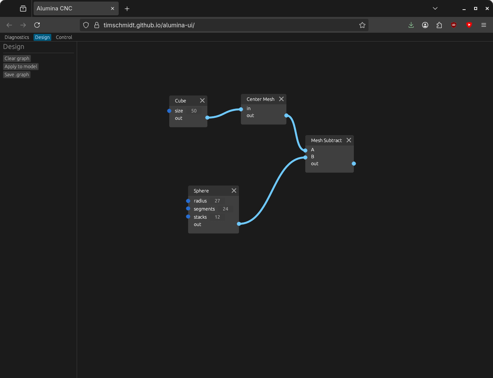
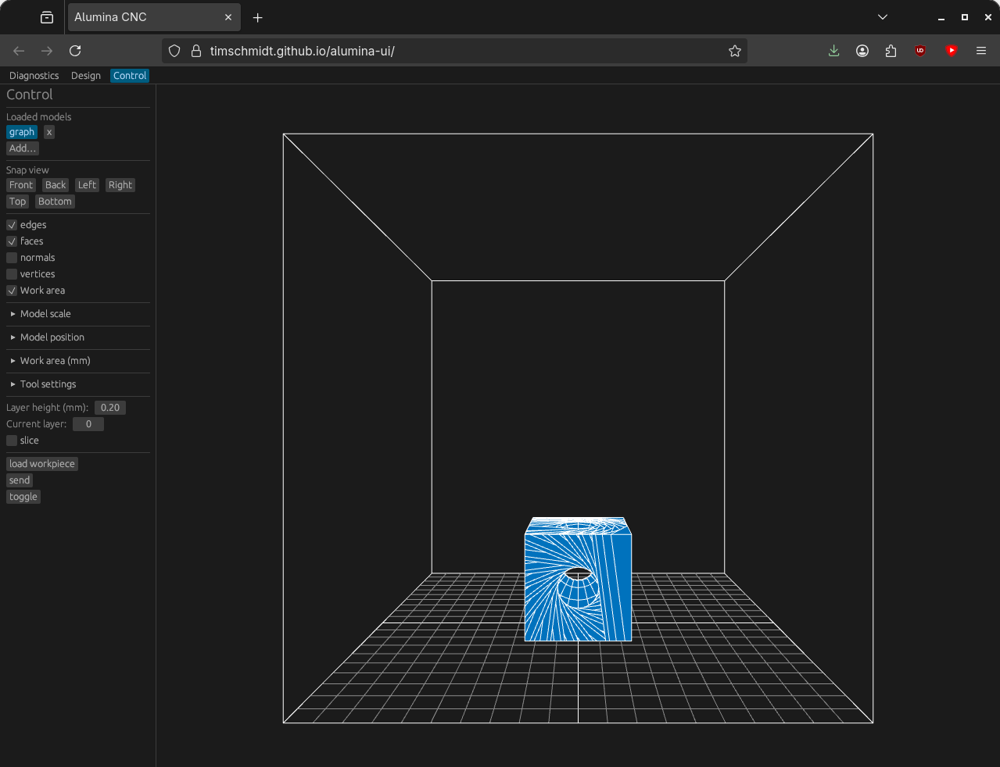
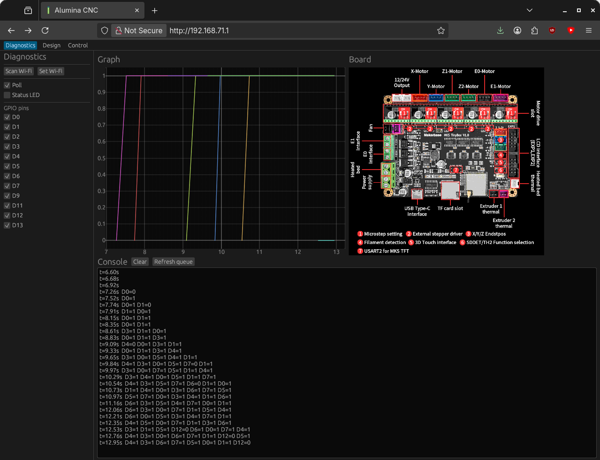
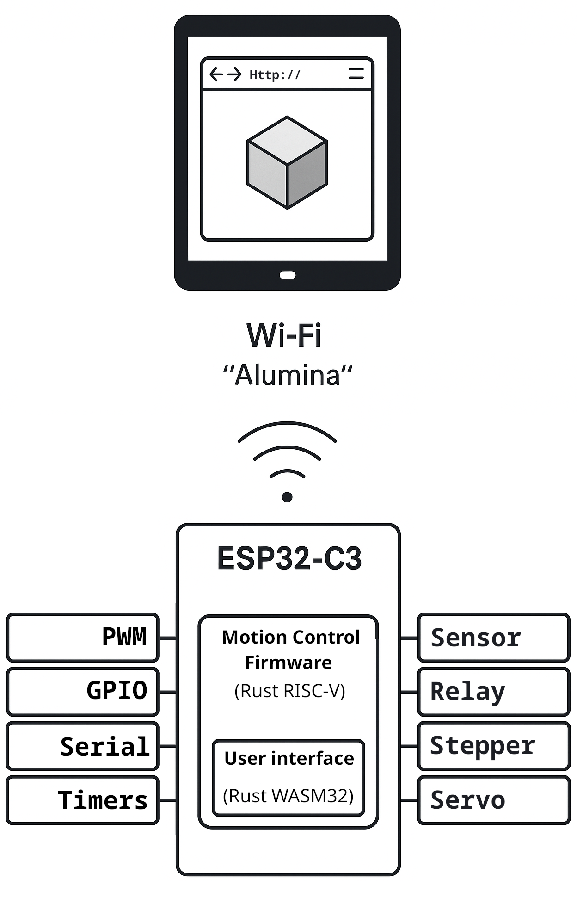

# Alumina Interface

Alumina Interface is the browser UI for the Alumina CAD/CAM and machine-control
system. It combines an `egui` application, a `csgrs`-backed node editor, a
WebGL model viewer, slicing controls, and firmware diagnostics in a WebAssembly
bundle intended to fit alongside Alumina Firmware on a controller.

[Try the web demo](https://timschmidt.github.io/alumina-interface/).

  

## Using the interface

- **Design** builds sketches and meshes as a node graph. Right-click the canvas
  to add primitives, Boolean operations, transformations, extrusion/revolve/
  loft/sweep nodes, slicing, text, or lattice operations. Connect a mesh output
  and select **Apply to model** to send each unconsumed root mesh to the viewer.
- **Control** imports STL or DXF workpieces and STL, DXF, OBJ, PLY, or AMF model
  selections, adjusts scale and position, inspects slices, and configures laser,
  plasma, extrusion, milling, drilling, or DLP/LCD tool parameters.
- **Diagnostics** sends firmware commands, polls GPIO state, plots selected pins,
  shows controller metadata, and displays the command queue log.

The WebGL viewer supports orbit, pan, wheel/pinch zoom, standard camera views,
edges, filled faces, normals, vertices, and the machine work envelope.

## Firmware contract

The interface expects these same-origin endpoints from
[Alumina Firmware](https://github.com/timschmidt/alumina-firmware):

| Endpoint | Method | Payload |
| --- | --- | --- |
| `/queue` | `GET` | Command queue as text |
| `/queue` | `POST` | One plain-text command |
| `/pins` | `GET` | JSON object mapping pin names to numeric states |
| `/device` | `GET` | JSON with `name`, `display_name`, `image_mime`, and `image_url` |

The firmware or static host must also serve the Trunk output (`index.html`, the
JavaScript loader, WASM bundle, favicon, and any device image URL). The post-build
hook creates gzip assets and, when `brotli` is installed, a Brotli-compressed WASM
bundle.

## Development

Install the Rust WASM target and build tools:

```sh
rustup target add wasm32-unknown-unknown
cargo install trunk wasm-opt wasm-tools
```

Run a release-mode development server:

```sh
trunk serve --open --release
```

Produce the deployable bundle without opening a browser:

```sh
trunk build --release
```

## Architecture and references



- [`eframe` and `egui`](https://github.com/emilk/egui) provide the application
  shell and immediate-mode UI.
- [`egui_node_graph2`](https://github.com/trevyn/egui_node_graph2) provides the
  visual design graph.
- [`csgrs`](https://github.com/timschmidt/csgrs) provides sketch, mesh, Boolean,
  transform, slicing, import, and lattice operations.
- [`hypergraphics`](https://github.com/timschmidt/hypergraphics) provides the
  shared colored-mesh WebGL renderer and primitive-float rendering boundary.
- [Trunk](https://trunkrs.dev/) builds and serves the WebAssembly application.
- The [Web Storage standard](https://html.spec.whatwg.org/multipage/webstorage.html)
  defines the browser-local storage used by the TrueType text node.

Community: [Discord](https://discord.gg/cCHRjpkPhQ)
